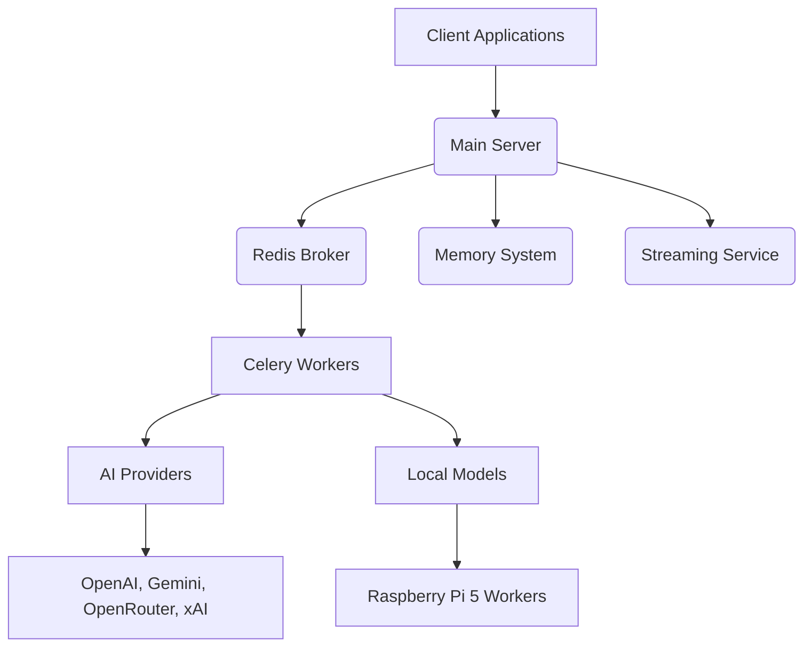

# 🤖 AgentSystem: Distributed AI Orchestration for Edge Computing

<div align="center">


[](https://www.python.org/)
[](https://opensource.org/licenses/MIT)
[](https://github.com/ereezyy/AgentSystem/actions)
[](https://github.com/ereezyy/AgentSystem/actions)
[](https://docs.celeryq.dev/en/stable/)
[](https://redis.io/)
[](https://www.raspberrypi.com/)
[](https://discord.gg/your-community-link)

**🚀 DISTRIBUTED AI • 🧠 EDGE COMPUTING • 🤖 AUTONOMOUS AGENTS • ⚡ MULTI-PROVIDER LLMs**

</div>

---

## 🎯 Project Overview: Orchestrate the Future of AI 🎯

**AgentSystem** is a cutting-edge distributed AI framework meticulously engineered to orchestrate complex AI workloads across a diverse range of computing environments. From high-performance cloud servers to resource-constrained edge devices like the Raspberry Pi 5, AgentSystem provides a robust and scalable solution for deploying and managing intelligent agents. It leverages Celery for efficient task distribution, supports seamless integration with multiple leading AI providers (OpenAI, Gemini, OpenRouter, xAI), and features advanced autonomous operations with persistent memory and context management.

Designed for the demands of modern AI applications, AgentSystem empowers developers and researchers to build, deploy, and scale sophisticated AI agents that can operate intelligently and autonomously in real-world scenarios. Whether you're building a fleet of edge-AI devices or a powerful cloud-based AI service, AgentSystem provides the foundational infrastructure to bring your vision to life.

## ✨ Key Features: Command Your AI Ecosystem ✨

*   🚀 **Distributed Task Queue**: Powered by Celery, enabling efficient distribution of AI tasks across a network of workers, ensuring scalability and fault tolerance.
*   🧠 **Multi-Provider AI Integration**: Seamlessly switch between and leverage the strengths of various AI providers, including OpenAI, Google Gemini, OpenRouter, and xAI (Grok), along with support for local models.
*   🔄 **Autonomous Operations**: Build self-managing AI agents with persistent memory and context, allowing them to learn, adapt, and execute complex tasks autonomously.
*   📡 **Edge Optimized**: Engineered for efficient performance on edge devices, particularly the Raspberry Pi 5 with AI HAT+, making advanced AI accessible for embedded and IoT applications.
*   📊 **Real-Time Streaming**: WebSocket-based streaming for instantaneous AI responses, crucial for interactive applications and real-time decision-making.
*   💾 **Memory System**: Robust persistent conversation history and context management, enabling AI agents to maintain coherent and informed interactions over time.
*   ⚡ **Multimodal Support**: Comprehensive integration of text, image, and vision models, allowing agents to process and understand diverse forms of data.

## 🏛️ Architecture: The Blueprint of Intelligence 🏛️

AgentSystem employs a modular and distributed architecture to ensure scalability, flexibility, and high availability. The core components work in concert to manage AI tasks, distribute workloads, and maintain system intelligence.



### Component Breakdown:

*   **Main Server**: The central coordinator, typically a Flask or FastAPI application, handling client requests, managing tasks, and interacting with the memory and streaming services.
*   **Redis Broker**: Serves as the message broker for Celery, facilitating communication and task queuing between the main server and workers.
*   **Celery Workers**: Distributed processes that execute AI tasks. These can run on various hardware, from cloud instances to Raspberry Pi 5 devices.
*   **AI Providers**: External APIs (OpenAI, Gemini, OpenRouter, xAI) that provide advanced LLM and multimodal capabilities.
*   **Local Models**: AI models deployed directly on edge devices (e.g., Raspberry Pi 5 with AI HAT+) for low-latency inference.
*   **Memory System**: Manages persistent conversation history and contextual information for autonomous agents.
*   **Streaming Service**: Utilizes WebSockets to provide real-time streaming of AI responses back to client applications.

## 🛠️ Tech Stack: Fueling the Orchestration 🛠️

AgentSystem is built upon a robust and modern technology stack, ensuring high performance, scalability, and developer efficiency.

| Category           | Technology         | Description                                                               |
| :----------------- | :----------------- | :------------------------------------------------------------------------ |
| **Core Language**  | Python 3.9+        | The primary programming language for the AgentSystem backend and AI logic. |
| **Task Queue**     | Celery             | Distributed task queue for asynchronous task processing.                  |
| **Message Broker** | Redis              | High-performance in-memory data store, used as Celery broker and backend. |
| **Web Framework**  | Flask/FastAPI      | (Conceptual) For the main server API and web interface.                   |
| **AI/LLM Providers** | OpenAI, Gemini, OpenRouter, xAI (Grok) | Integrations with leading AI models for diverse capabilities.             |
| **Edge Computing** | Raspberry Pi 5, AI HAT+ | Optimized for high-performance AI inference on edge devices.              |
| **Memory**         | (Custom/Database)  | Persistent storage for agent memory and context.                          |
| **Streaming**      | WebSockets         | Real-time communication for AI response streaming.                        |
| **Testing**        | Pytest             | (Planned) Comprehensive testing framework for code quality.               |
| **Linting**        | Flake8, Black      | (Planned) Code style enforcement and formatting.                          |

## 🚀 Installation: Deploy Your Agent Fleet 🚀

Follow these instructions to set up and run AgentSystem locally or on your distributed network.

### Prerequisites

*   **Python 3.9+**
*   **Redis**: A running Redis instance (local or remote) for the Celery broker and result backend.
*   **API Keys**: Required for integrating with external AI providers (OpenAI, Gemini, OpenRouter, xAI).
*   **Git**

### 1. Clone the Repository

```bash
git clone https://github.com/ereezyy/AgentSystem.git
cd AgentSystem
```

### 2. Install Dependencies

It is highly recommended to use a virtual environment.

```bash
python3 -m venv venv
source venv/bin/activate
pip install -r requirements-prod.txt
```

### 3. Configuration

Rename `.env.example` to `.env` and populate it with your API keys and Redis connection details. Refer to the `.env.example` file for all required variables.

```bash
cp .env.example .env
# Open .env and add your API keys and Redis URL
```

## ⚡ Quick Start: Activate Your Distributed AI ⚡

### 1. Start Redis (if not already running)

```bash
redis-server
```

### 2. Start a Celery Worker

```bash
celery -A core.celery_app worker --loglevel=info
```

### 3. Run Your Main Application (Example)

(Assuming you have a Flask/FastAPI app in `main.py` or similar)

```bash
python main.py
```

### Raspberry Pi 5 Deployment

For detailed instructions on deploying AgentSystem to Raspberry Pi 5 devices, including setup with AI HAT+, please refer to the dedicated [Installation Guide](INSTALL.md).

## 💡 Use Cases: Unleash the Potential 💡

AgentSystem is designed for a wide array of advanced AI applications:

*   **Multi-device AI Workloads**: Distribute computationally intensive AI tasks across a network of machines, optimizing resource utilization and throughput.
*   **Edge AI Deployments**: Run sophisticated AI models directly on Raspberry Pi clusters and other edge devices for low-latency, cost-effective inference in IoT and embedded systems.
*   **Autonomous Agent Orchestration**: Build and manage fleets of autonomous AI agents with persistent memory and complex task queuing capabilities.
*   **Hybrid Cloud/Edge Setups**: Seamlessly combine the power of cloud-based GPUs with local edge devices for flexible and scalable AI infrastructure.
*   **Real-time AI Services**: Develop applications requiring instantaneous AI responses, such as intelligent monitoring, automated decision-making, and interactive AI assistants.

## ⚙️ Environment Variables: Configure Your Swarm ⚙️

To unlock the full potential of AgentSystem, especially its AI provider integrations and distributed capabilities, certain environment variables must be configured. Create a `.env` file in your project root or set these variables in your shell environment.

| Variable Name             | Description                                                               | Example Value                                         |
| :------------------------ | :------------------------------------------------------------------------ | :---------------------------------------------------- |
| `CELERY_BROKER_URL`       | URL for the Celery message broker (e.g., Redis).                          | `redis://localhost:6379/0`                            |
| `CELERY_RESULT_BACKEND`   | URL for the Celery result backend (e.g., Redis).                          | `redis://localhost:6379/0`                            |
| `OPENAI_API_KEY`          | Your API key for OpenAI services.                                         | `sk-xxxxxxxxxxxxxxxxxxxxxxxxxxxxxxxxxxxxxxxx`         |
| `GOOGLE_API_KEY`          | Your API key for Google Gemini services.                                  | `AIzaSyBxxxxxxxxxxxxxxxxxxxxxxxxxxxxxxxxx`            |
| `OPENROUTER_API_KEY`      | Your API key for OpenRouter services.                                     | `sk-or-xxxxxxxxxxxxxxxxxxxxxxxxxxxxxxxxxxxxxxxx`      |
| `XAI_API_KEY`             | Your API key for xAI (Grok) services.                                     | `gsk_xxxxxxxxxxxxxxxxxxxxxxxxxxxxxxxxxxxxxxxx`        |
| `CELERY_WORKER_CONCURRENCY` | Number of concurrent tasks a Celery worker can handle. Adjust based on hardware. | `4`                                                   |

## 📂 Project Structure: The Organized Chaos 📂

```
AgentSystem/
├── core/                    # Core system modules (Celery config, memory, main config)
│   ├── celery_app.py       # Celery application instance and configuration
│   ├── memory.py           # Memory persistence and context management
│   └── config.py           # Centralized system configuration
├── services/                # AI provider integrations and streaming
│   ├── ai_providers/       # Modules for OpenAI, Gemini, xAI, etc. integrations
│   ├── ai.py               # Main AI service interface
│   └── streaming_service.py# WebSocket-based real-time streaming
├── autonomous/              # Autonomous operations engine and logic
├── modules/                 # Feature modules and extensions
├── utils/                   # Utility functions and helper scripts
├── docs/                    # Additional documentation (Installation Guide, etc.)
├── tests/                   # Test suite for unit and integration tests
├── .env.example             # Example environment variables file
├── .gitignore               # Git ignore rules
├── README.md                # This documentation file
├── requirements-prod.txt    # Production Python dependencies
├── requirements-dev.txt     # Development Python dependencies
├── setup.py                 # Python package setup script
└── ...                      # Other project files
```

## 🗺️ Roadmap: The Path to Singularity 🗺️

Our journey to advanced distributed AI is continuous. Here's what's on the horizon:

*   ✅ **Multi-modal RAG**: Knowledge base integration for enhanced contextual understanding.
*   ⏳ **Web UI**: A comprehensive dashboard for monitoring workers, tasks, and agent performance.
*   ⏳ **Auto-scaling**: Dynamic worker allocation based on workload and resource availability.
*   ⏳ **Function Calling**: Advanced tool use capabilities for autonomous agents.
*   ⏳ **Voice Support**: Seamless Speech-to-Text and Text-to-Speech integration for natural interactions.

## 🤝 Contributing: Join the Orchestration 🤝

We welcome contributions from developers, researchers, and AI enthusiasts who wish to enhance AgentSystem. Please refer to our [CONTRIBUTING.md](CONTRIBUTING.md) file for detailed guidelines on how to get involved, including our code standards, branching strategy, and pull request process.

## 🛡️ Security & Best Practices: Fortifying Your Operations 🛡️

Operating distributed AI systems demands rigorous security. Adhere to these best practices:

*   **Secure API Keys**: Never hardcode API keys or private credentials directly in your code. Use environment variables and secure secret management solutions.
*   **Network Security**: Implement robust network security measures for your Redis instance and inter-worker communication.
*   **Code Audits**: Regularly audit your code for vulnerabilities, especially when dealing with sensitive data or autonomous operations.
*   **Dependency Management**: Keep all project dependencies updated to their latest secure versions.
*   **Responsible Disclosure**: If you discover a security vulnerability, please report it responsibly through our designated `SECURITY.md` process.

## 📄 License

This project is licensed under the MIT License - see the [LICENSE](LICENSE) file for details.

---

## ✍️ Author

**Eddy Woods** ([@ereezyy](https://github.com/ereezyy))
*AI Engineer & Game Developer*

---

**⭐ Star this repo if you find it useful!**
